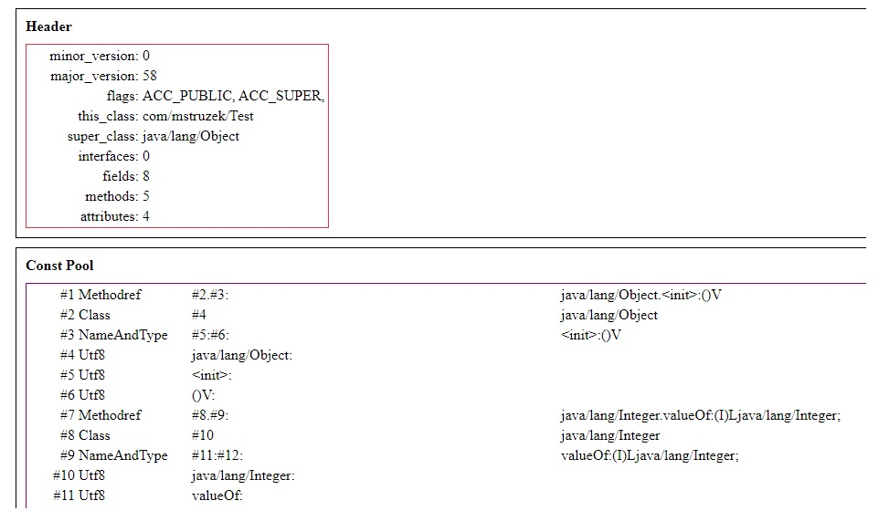
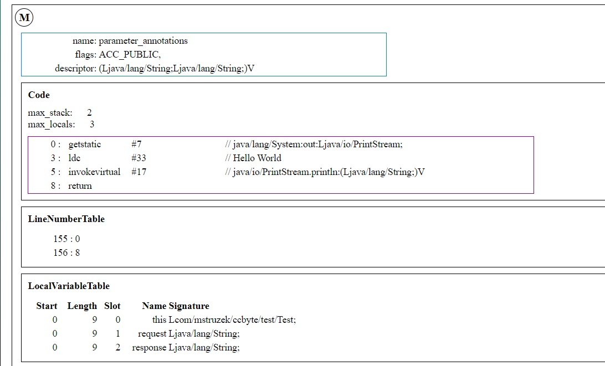

# ccbyte
### Byte Code Viewer

- Render html byte code view from a .class file.
- Full structure rendered with reflection api.
- Additional customizations via css.

### Implementation compliance 
MUST adhere to JVM Specification Java SE 14 / disassembler
    
     +  done
     %  waiting 
     #  rejected 

| Attribute                                |Status |
| ---------------------------------------- | ----- |
| AnnotationDefault                        |   %   |
| BootstrapMethods                         |   +   |                  
| Code                                     |   %   |      
| ConstantValue                            |   +   |              
| Deprecated                               |   +   |          
| EnclosingMethod                          |   +   |                  
| Exceptions                               |   +   |          
| InnerClasses                             |   +   |              
| LineNumberTable                          |   +   |                  
| LocalVariableTable                       |   +   |                  
| LocalVariableTypeTable                   |   +   |                      
| MethodParameters                         |   +   |                  
| Module                                   |   #   |      
| ModuleMainClass                          |   +   |                  
| ModulePackages                           |   #   |              
| NestHost                                 |   +   |          
| NestMembers                              |   +   |              
| RuntimeInvisibleAnnotations              |   +   |                              
| RuntimeInvisibleParameterAnnotations     |   +   |                                      
| RuntimeInvisibleTypeAnnotations          |   %   |                                  
| RuntimeVisibleAnnotations                |   +   |                          
| RuntimeVisibleParameterAnnotations       |   +   |                                  
| RuntimeVisibleTypeAnnotations            |   %   |                              
| Signature                                |   +   |          
| SourceDebugExtension                     |   +   |                      
| SourceFile                               |   +   |          
| StackMapTable                            |   +   |              
| Synthetic                                |   +   |          

